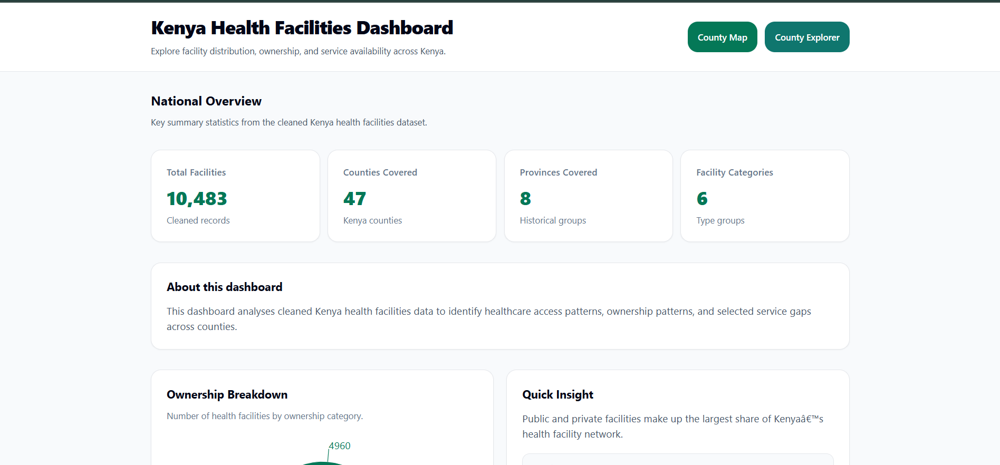
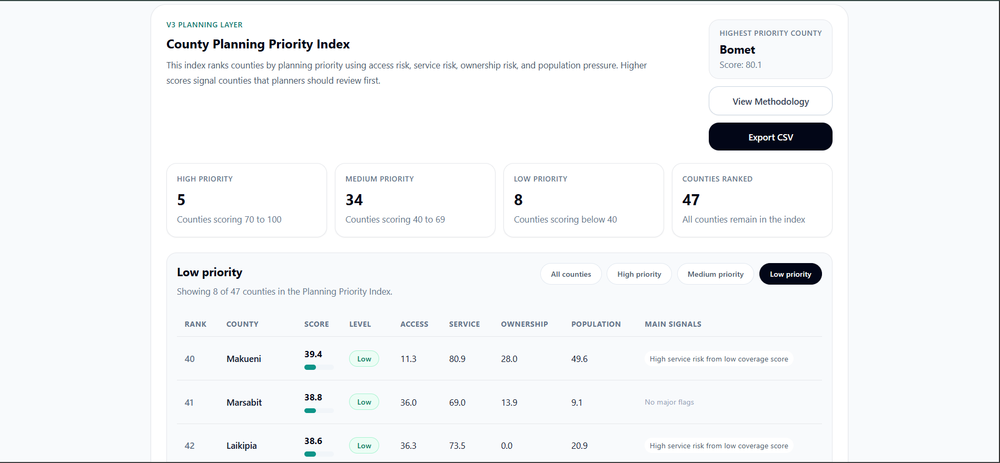
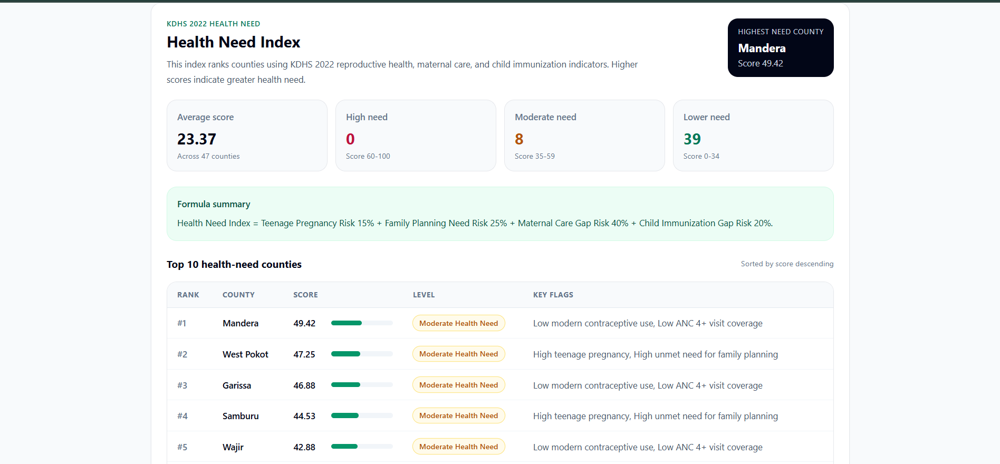
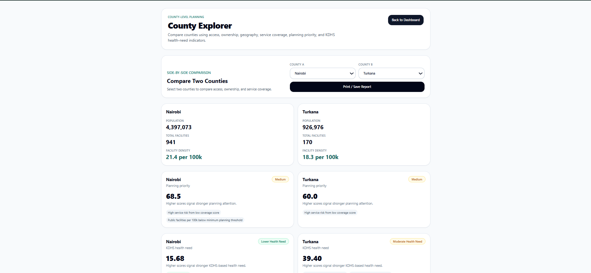
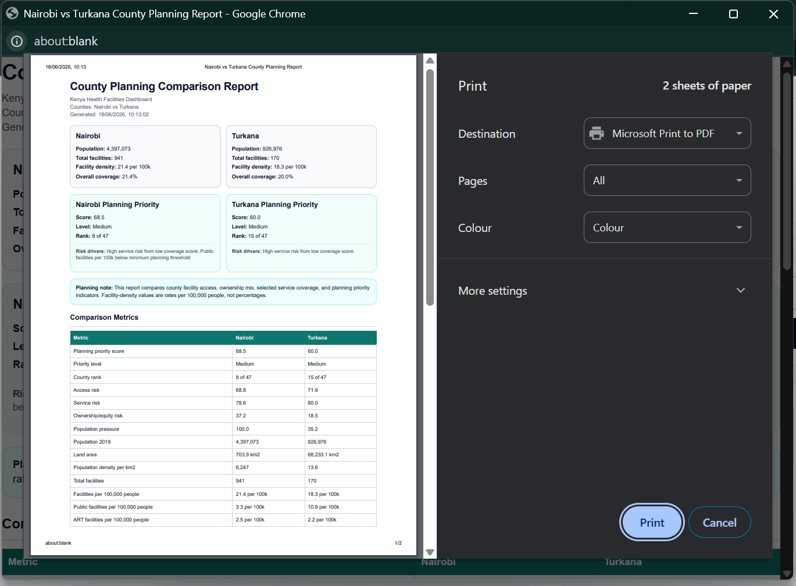
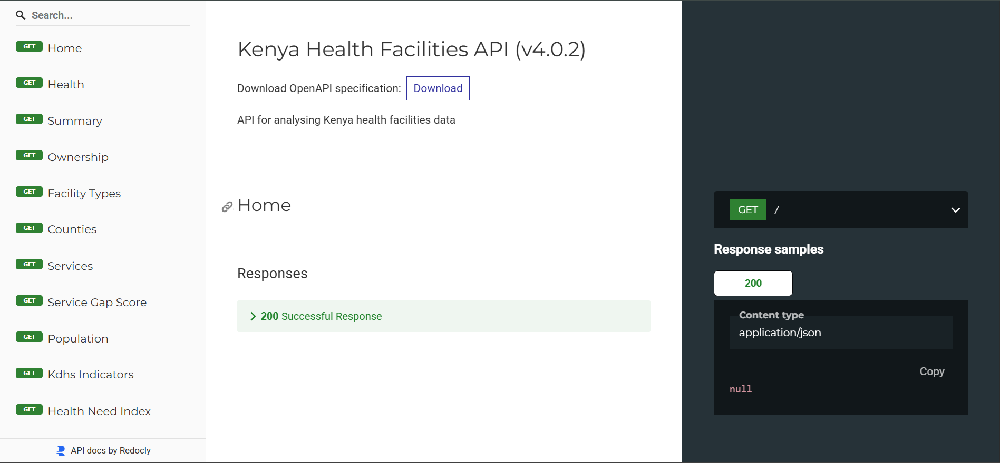

# Project Case Study: Kenya Health Facilities Dashboard


## Healthcare Planning Intelligence for Facility Access, Service Gaps, and Health Need in Kenya


## Project Summary


The Kenya Health Facilities Dashboard is a full-stack healthcare planning intelligence system that transforms Kenyan health facility, population, ownership, service availability, and KDHS 2022 indicator data into county-level planning insights.


The project started as a facility distribution dashboard and evolved into a decision-support workflow for comparing county access, service availability, ownership dynamics, planning priority, and health need.


Core question:


```text

To what extent does the county-level distribution of healthcare facilities in Kenya reflect both public health need and healthcare market dynamics?

```


Core portfolio message:


```text

I build health data products that turn messy public datasets into practical planning intelligence.

```


---


## Problem


Healthcare facility datasets can show where facilities exist, but raw records do not automatically answer planning questions.


A planner, analyst, or health-tech reviewer may need to know:


* Which counties have fewer facilities relative to population?

* Which counties depend more on public or private providers?

* Which counties show weaker service availability?

* Which counties should receive closer planning attention?

* Which counties show higher KDHS-based health need?

* How do two counties compare across access, ownership, service coverage, priority, and health need?


A raw facility table does not answer those questions directly.


The project addresses this gap by turning facility and health indicator data into structured planning signals.


---


## Why It Matters


Facility counts alone can mislead planning decisions.


A county with many facilities may still face pressure if its population is large. A county with fewer facilities may rely heavily on one ownership category. A county with reasonable access density may still show higher health need based on family planning, teenage pregnancy, maternal care, or immunization indicators.


This project combines multiple layers:


* Facility distribution

* Population-adjusted access

* Ownership mix

* Service availability

* County planning priority

* KDHS-based health need


The result is a clearer planning view than any single dataset can provide alone.


---


## Data Sources


The project uses three main data layers:


1. Kenya health facility records

2. 2019 Kenya county population data

3. KDHS 2022 county-level indicator data


These sources support facility access analysis, population-adjusted comparisons, ownership interpretation, service-gap review, and health-need scoring.


---


## Data Challenges


The project required several data preparation steps before analysis could become useful.


Key challenges included:


* Inconsistent county names across datasets

* Facility records that needed grouping by county

* Ownership categories that needed normalization

* Service availability fields that needed aggregation

* Population data that had to be joined to facility data

* KDHS indicators that had to align with county-level planning views

* Derived scores that needed safe handling for missing or incomplete values


---


## County-Name Normalization


County-name normalization was important because facility, population, and indicator datasets may represent county names differently.


Examples of normalization needs include:


* Slash-separated names

* Hyphenated names

* Apostrophes

* Uppercase formatting

* Alternative county labels


Normalization made it possible to join datasets consistently and avoid losing counties during merges.


---


## Product Approach


The project followed a staged product progression.


### V1 - Core Dashboard Foundation


Started with a working dashboard and API for exploring facility distribution, ownership, service availability, ART access, search, filters, and CSV export.


### V2 - Population-Adjusted Access and Market Dynamics


Added population context so users could compare facility access relative to population size, not raw facility counts only.


### V3 - County Planning Priority Index


Combined access risk, service risk, ownership risk, and population pressure into a county-level priority score.


### V4 - Health Need Index


Added KDHS 2022 health-need indicators to bring demand-side planning signals into the system.


### V4.0.2 - Planning Report Polish


Improved reporting, filtering, export, methodology explanation, loading states, error states, and empty states.


### V5 – Need-Access Gap Intelligence

**Status:** Released (Frontend V5 • Backend API v5.0.2)

The fifth release extends the dashboard beyond measuring healthcare access by introducing a **Need vs Access Gap** layer. This feature combines healthcare need indicators with access metrics to identify counties where demand for services is high relative to available healthcare resources.

Key additions include:

- Need vs Access Gap Index
- County intervention prioritization
- County Explorer integration
- Backend API endpoint (`/need-access-gap-index`)
- Frontend visualization and interpretation
- Production-ready portfolio release

This release demonstrates how public health datasets can be transformed into practical planning intelligence that supports evidence-based resource allocation and county-level decision-making.

For implementation details, see:

- `docs/V5_PRODUCTION_PORTFOLIO_RELEASE.md`


The dashboard calculates access density using facilities per 100,000 people.


This includes:


* Total facilities per 100,000 people

* Public facilities per 100,000 people

* ART facilities per 100,000 people


This makes county comparison more realistic.


Raw facility totals answer:


```text

How many facilities does a county have?

```


Population-adjusted access answers:


```text

How much facility access exists relative to population size?

```


---


## Ownership and Market Dynamics


The dashboard analyzes ownership patterns across provider categories.


Ownership categories include:


* Public

* Private

* Faith-based

* NGO

* Community

* Academic


This helps show whether a county's facility landscape depends more on public delivery, private-market activity, or faith-based and NGO-supported care.


---


## County Planning Priority Index


The Planning Priority Index ranks counties using multiple planning signals.


The index combines:


* Access risk

* Service risk

* Ownership risk

* Population pressure


The output includes:


* Priority score

* Priority level

* National rank

* Component scores

* Reason flags


This helps users identify counties that may need closer review.


The score should be used as a planning signal, not as a final decision. It does not replace local context, budget review, disease burden analysis, staffing data, facility quality data, or operational judgment.


---


## Health Need Index


The Health Need Index uses KDHS 2022 county indicator data to estimate relative health need.


The index calculates component scores from:


* Teenage pregnancy

* Family planning need

* Maternal care gaps

* Child immunization gaps


The output includes:


* Health need score

* Health need level

* Component scores

* Input metrics

* Reason flags


The Health Need Index adds demand-side context to the facility access analysis.


---


## System Architecture


### Frontend


The frontend provides dashboard sections, visual summaries, county comparison, filters, methodology explanation, print reports, and CSV export.


Key frontend responsibilities:


* Fetch API data

* Render dashboard sections

* Support county comparison

* Display priority and health-need signals

* Handle loading, error, and empty states

* Generate printable reports

* Export selected planning data


### Backend


The backend exposes structured API endpoints for facility, population, service, planning, and health-need data.


Key backend responsibilities:


* Load and prepare datasets

* Normalize county names

* Aggregate facility records

* Calculate density metrics

* Calculate planning priority scores

* Calculate health need scores

* Serve JSON responses

* Support CSV export

* Apply rate limiting and security headers


### Deployment


The project is deployed with:


* Vercel for the frontend

* Render for the backend

* FastAPI Swagger/OpenAPI for API documentation


---


## Key Features


* National facility distribution dashboard

* County-level facility counts

* Ownership analysis

* Service availability analysis

* ART service gap analysis

* Population-adjusted access analysis

* Ownership and market dynamics section

* County Explorer

* Side-by-side county comparison

* County Planning Priority Index

* KDHS-based Health Need Index

* Printable county planning report

* Planning Priority CSV export

* Methodology modal

* Public API documentation


---


## Screenshots


### Dashboard Overview





### County Planning Priority Index





### Health Need Index





### County Explorer Comparison





### Printable County Planning Report





### API Documentation





---


## Impact


This project demonstrates how public health datasets can become a planning-support product.


It helps users move from:


```text

Raw facility records

```


to:


```text

County-level planning intelligence

```


The project shows practical value across:


* Healthcare analytics

* Public data cleaning

* County-level comparison

* Planning index design

* API development

* Frontend data storytelling

* Product documentation


---


## Limitations


The system does not measure every factor needed for real-world healthcare planning.


Current limitations include:


* No direct facility quality measurement

* No staffing levels

* No stock availability

* No patient outcome data

* No travel-time or road-network access layer

* No facility workload data

* No budget or county expenditure data

* No time-series trend analysis

* KDHS indicators depend on available county-level values

* Index scores are planning signals, not final decisions


---


## What I Learned


This project strengthened my understanding of how data products must connect analysis, workflow, and interpretation.


Key lessons:


* Raw counts rarely answer planning questions alone.

* County comparison needs population adjustment.

* Dataset joins require careful name normalization.

* Index design must expose component scores and reason flags.

* Methodology explanations build user trust.

* Export and print workflows matter for planning use cases.

* A dashboard becomes more valuable when it supports decisions, not just charts.


---


## Next Steps


Planned improvements include:


* Formalize Need-Access Gap Intelligence

* Add a need-access mismatch dashboard layer

* Add county intervention watchlists

* Improve methodology validation

* Add automated API tests

* Add frontend test coverage

* Add more planning report export options

* Add additional health outcome indicators if reliable data becomes available


---


## Portfolio Relevance


This project is positioned for:


Primary audience:


```text

Data / Analytics roles

```


Secondary audience:


```text

Health-tech / Digital Health roles

```


Supporting audience:


```text

Full-stack development roles

```


It demonstrates the ability to build data products that connect messy public datasets, backend APIs, frontend analytics, and planning workflows.


