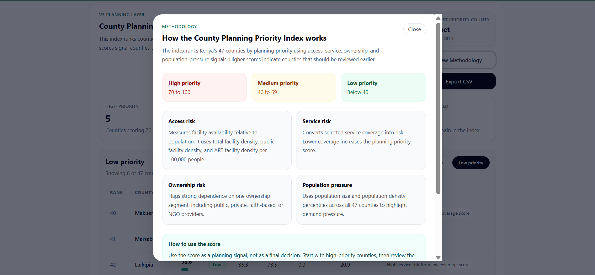
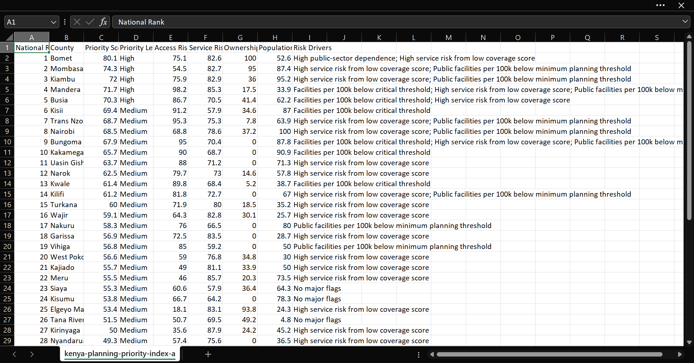

# Kenya Health Facilities Dashboard

## Healthcare Planning Intelligence for Facility Access, Service Gaps, and Health Need in Kenya

A full-stack healthcare planning intelligence system that transforms Kenyan health facility, population, ownership, service availability, and KDHS 2022 indicator data into county-level planning insights.

The project helps answer one core question:

```text
To what extent does the county-level distribution of healthcare facilities in Kenya reflect both public health need and healthcare market dynamics?
```

Instead of presenting raw facility records alone, the system turns fragmented public datasets into planning signals that can support county comparison, access review, service-gap analysis, ownership assessment, and health-need prioritization.

---

## Live Project

* Frontend: https://kenya-health-dashboard.vercel.app/
* County Explorer: https://kenya-health-dashboard.vercel.app/county-explorer
* Backend API: https://kenya-health-dashboard-api.onrender.com/
* API documentation: https://kenya-health-dashboard-api.onrender.com/docs
* GitHub repository: https://github.com/arapkirui513-hub/kenya-health-dashboard

---

## Portfolio Positioning

Primary audience:

```text
Data / Analytics roles
```

Secondary audience:

```text
Health-tech / Digital Health roles
```

Supporting audience:

```text
Full-stack development roles
```

Core portfolio message:

```text
I build health data products that turn messy public datasets into practical planning intelligence.
```

---

## Why This Project Matters

Healthcare facility data is useful, but facility counts alone do not answer planning questions.

A county with many facilities may still face access pressure if its population is large. A county with fewer facilities may depend heavily on one ownership category. A county with better facility density may still show high health need based on maternal care, family planning, teenage pregnancy, or immunization indicators.

This project connects those layers into a planning workflow.

It helps users review:

* Facility distribution by county
* Population-adjusted facility access
* Public, private, faith-based, NGO, community, and academic ownership patterns
* Selected service availability
* ART service access
* County planning priority
* KDHS-based health need
* Side-by-side county comparison
* Printable county planning reports
* CSV exports for further analysis

---

## Key Product Questions

The system supports questions such as:

* Which counties have the most health facilities?
* Which counties have fewer facilities relative to population size?
* Which counties rely more heavily on public facilities?
* Which counties show stronger private healthcare market activity?
* Which counties have faith-based or NGO-supported service delivery?
* Which counties show weaker selected service coverage?
* Which counties should planners review first?
* Which counties show higher KDHS-based health need?
* How do two counties compare across access, ownership, service coverage, planning priority, and health need?

---

## Main Features

### National Dashboard

Provides a national view of facility distribution, ownership patterns, service availability, access density, planning priority, and health need.

### Population-Adjusted Access

Calculates facility access relative to county population using facilities per 100,000 people.

This helps avoid overvaluing raw facility counts.

### Ownership & Market Dynamics

Shows how different provider categories shape healthcare access at county level.

Ownership categories include:

* Public
* Private
* Faith-based
* NGO
* Community
* Academic

## Production Performance Results

The dashboard was optimized for production performance, accessibility, SEO, and lightweight initial loading.

### PageSpeed Insights Results

Latest mobile PageSpeed Insights score:

| Category         | Score |
| ---------------- | ----: |
| Performance      |    95 |
| Accessibility    |   100 |
| Best Practices   |   100 |
| SEO              |   100 |
| Agentic Browsing |   2/3 |

### Before vs After

| Metric         | Before | After |
| -------------- | -----: | ----: |
| Performance    |     56 |    95 |
| Accessibility  |    100 |   100 |
| Best Practices |    100 |   100 |
| SEO            |    100 |   100 |

### What Improved

* Added route-level code splitting for Dashboard, County Explorer, and Map pages.
* Lazy-loaded heavy dashboard sections.
* Deferred Facility Finder API calls until users scroll near that section.
* Reduced the Dashboard JavaScript chunk from about 435 kB to about 48 kB.
* Prevented the large MapPage bundle from loading during homepage initial load.

### Evidence

The PageSpeed result is documented in:

* `docs/PERFORMANCE_OPTIMIZATION_NOTE.md`
* `docs/screenshots/pagespeed-after-performance-optimization.png`


### County Planning Priority Index

Ranks counties using planning signals from:

* Access risk
* Service risk
* Ownership risk
* Population pressure

The index produces:

* Priority score
* Priority level
* National rank
* Component risk scores
* Reason flags

### Health Need Index

Uses KDHS 2022 county indicator data to estimate health need across:

* Teenage pregnancy
* Family planning need
* Maternal care gaps
* Child immunization gaps

The index produces:

* Health need score
* Health need level
* Component scores
* Input metrics
* Reason flags

### County Explorer

Allows side-by-side comparison of two counties across:

* Facility access
* Population-adjusted access
* Ownership mix
* Service coverage
* Planning priority
* Health need

### Planning Reports and Exports

V4.0.2 added planning-grade reporting support:

* Printable county comparison report
* Planning Priority CSV export
* Priority-level filters
* Methodology modal
* Improved loading states
* Improved error states
* Improved empty states

---

## Screenshots

### Dashboard Overview


### County Planning Priority Index


### Planning Priority Methodology Modal



### Health Need Index


### County Explorer Comparison


### Printable County Planning Report


### Planning Priority CSV Export



### API Documentation


---

## Data Sources

The project combines:

* Kenya health facility records
* 2019 Kenya county population data
* KDHS 2022 county-level indicator data

Data work includes:

* County-name normalization
* Facility ownership grouping
* Service availability parsing
* Population-adjusted density calculations
* County-level indicator integration
* Derived planning index creation
* API-safe output formatting

---

## Methodology Overview

### Population-Adjusted Access

The access layer calculates:

* Total facilities per 100,000 people
* Public facilities per 100,000 people
* ART facilities per 100,000 people

This helps compare counties more fairly than raw facility counts alone.

### County Planning Priority Index

The Planning Priority Index combines:

```text
Priority Score =
  Access Risk * 0.40
+ Service Risk * 0.30
+ Ownership Risk * 0.20
+ Population Pressure * 0.10
```

Priority levels:

```text
High: 70 and above
Medium: 40 to 69.99
Low: below 40
```

Full methodology:

```text
docs/PLANNING_PRIORITY_INDEX_METHODOLOGY.md
```

### Health Need Index

The Health Need Index uses KDHS 2022 county indicators to estimate relative health need.

The current backend calculates component scores for:

* Teenage pregnancy risk
* Family planning need risk
* Maternal care gap risk
* Child immunization gap risk

Full methodology:

```text
docs/HEALTH_NEED_INDEX_METHODOLOGY.md
```

---

## API Endpoints

Key endpoints include:

```text
GET /
GET /health
GET /summary
GET /ownership
GET /facility-types
GET /counties
GET /services
GET /service-gap-score
GET /population
GET /access-density
GET /planning-priority-index
GET /kdhs-indicators
GET /county-health-needs
GET /health-need-index
GET /need-access-gap-index
GET /facilities
GET /facilities/export
```

API documentation:

```text
https://kenya-health-dashboard-api.onrender.com/docs
```

---

## Architecture

### Frontend

* React
* Vite
* JavaScript
* Recharts
* CSS

### Backend

* FastAPI
* Python
* pandas
* SlowAPI rate limiting
* CSV export support

### Deployment

* Frontend: Vercel
* Backend: Render
* API docs: FastAPI OpenAPI / Swagger UI

---

## Version Progression

### V1 – Core Dashboard Foundation

Answered:

```text
Where are Kenya’s health facilities, and how are they distributed?
```

Included:

* Facility distribution dashboard
* County-level facility counts
* Ownership analysis
* Service availability
* ART service gap analysis
* Facility search and filters
* CSV export
* FastAPI backend
* React frontend
* Public deployment

### V2 – Population-Adjusted Access and Market Dynamics

Answered:

```text
Are facilities distributed according to population and ownership patterns?
```

Included:

* County population dataset
* Population-adjusted facility access
* County Explorer
* Side-by-side county comparison
* County Insight Brief
* Ownership & Market Dynamics section
* Mobile polish
* Backend security improvements

### V3 – County Planning Priority Index

Answered:

```text
Which counties should planners pay attention to first?
```

Included:

* Planning priority endpoint
* Access risk scoring
* Service risk scoring
* Ownership risk scoring
* Population pressure scoring
* Priority levels
* Reason flags
* Planning Priority dashboard section

### V4 – Health Need Index

Answered:

```text
Which counties show higher health need based on KDHS 2022 indicators?
```

Included:

* KDHS 2022 county indicator layer
* Health Need Index
* Health need levels
* Component scores
* Reason flags
* Health Need dashboard section
* County Explorer health-need comparison

### V4.0.2 – Planning Report Polish

Answered:

```text
Can users export, explain, and share the planning insights?
```

Included:

* Planning-grade County Explorer print report
* Planning Priority CSV export
* Priority-level filters
* Methodology modal
* Improved loading states
* Improved error states
* Improved empty states

### V5 – Need-Access Gap Intelligence

Current state:

```text
Early backend/API work is present, but this is not yet packaged as a formal portfolio release.
```

Planned direction:

* High need plus low access flag
* County intervention watchlist
* Need-access mismatch layer
* Public-sector intervention priority
* County Explorer need-access interpretation

---

## Documentation

* V1 completion report: `docs/V1_COMPLETION_REPORT.md`
* V2 completion report: `docs/V2_COMPLETION_REPORT.md`
* V3 completion report: `docs/V3_COMPLETION_REPORT.md`
* V4 completion report: `docs/V4_COMPLETION_REPORT.md`
* V4.0.2 completion report: `docs/V4_0_2_COMPLETION_REPORT.md`
* Security review: `docs/SECURITY_REVIEW.md`
* Planning Priority methodology: `docs/PLANNING_PRIORITY_INDEX_METHODOLOGY.md`
* Health Need methodology: `docs/HEALTH_NEED_INDEX_METHODOLOGY.md`

---

## What This Project Demonstrates

This project demonstrates applied data and product skills across:

* Public dataset cleaning
* Healthcare analytics
* County-level planning analysis
* Feature engineering
* Index design
* API development
* Frontend data storytelling
* Documentation
* Deployment
* Planning workflow design

It shows how messy public health data can become a practical product layer for review, comparison, and planning.


