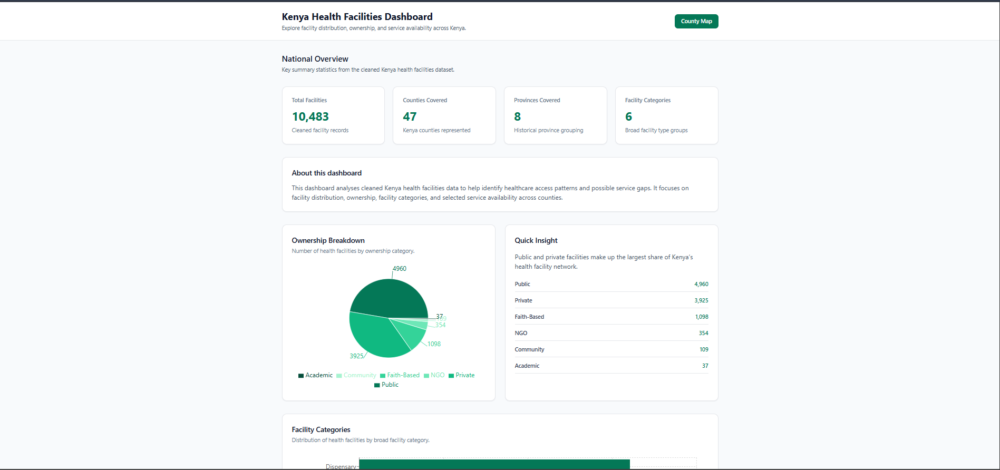
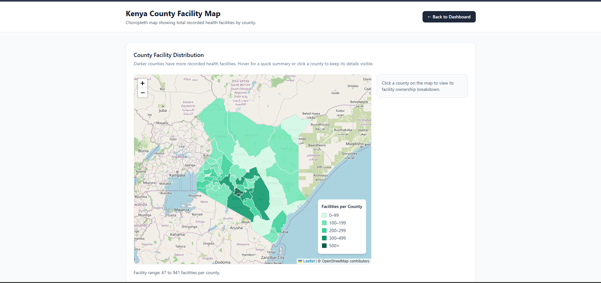
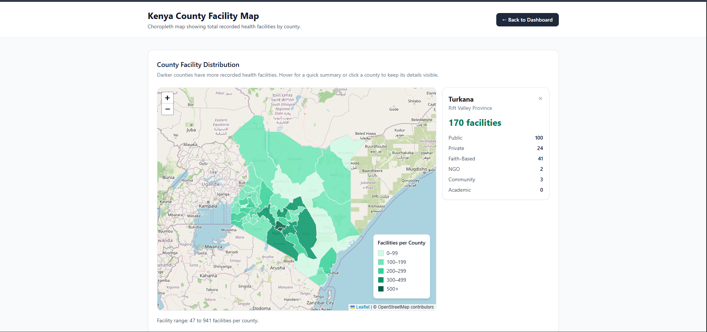

# Kenya Health Facilities Dashboard

A full-stack healthcare analytics dashboard that explores health facility distribution, ownership patterns, service availability, and healthcare access insights across Kenya.

Built using FastAPI, React, Pandas, Tailwind CSS, Recharts, and React Leaflet.

---

## Live Demo

### Frontend

https://kenya-health-dashboard.vercel.app/

### Backend API

https://kenya-health-dashboard-api.onrender.com/

### API Documentation

https://kenya-health-dashboard-api.onrender.com/docs

### GitHub Repository

https://github.com/arapkirui513-hub/kenya-health-dashboard

---

## Project Overview

This project analyses cleaned Kenya health facilities data to identify healthcare access patterns and planning opportunities across counties.

The dashboard helps answer questions such as:

- Which counties have the highest concentration of health facilities?
- Which counties have the fewest facilities?
- What ownership categories dominate healthcare provision?
- What facility categories are most common?
- How widely available are key healthcare services?
- Which counties show potential ART service gaps?
- How are facilities distributed geographically across Kenya?
- Can facilities be searched, filtered, and exported for further analysis?

The project was developed as a portfolio-ready full-stack data analytics application.

---

## Features

### National Overview

- Total facilities
- Counties covered
- Provinces covered
- Facility categories

### Interactive Visualisations

- Ownership breakdown pie chart
- Facility category bar chart
- Top 10 counties by facility count
- Counties with the fewest facilities
- Service availability comparison chart
- ART service gap analysis

### Facility Finder

- Search facilities by name
- Filter by county
- Filter by ownership
- Filter by facility category
- Pagination
- CSV export of filtered results

### Kenya County Choropleth Map

- Interactive county boundary map
- Dynamic choropleth colouring
- Hover tooltips
- County ownership breakdown
- Clickable county information panel
- Dynamic legend

---

## Technology Stack

### Backend

- FastAPI
- Pandas
- OpenPyXL
- Uvicorn

### Frontend

- React
- Vite
- Tailwind CSS
- Axios
- Recharts
- React Leaflet
- Leaflet

### Deployment

- Render (Backend)
- Vercel (Frontend)

### Version Control

- Git
- GitHub

---

## Project Structure

```text
kenya-health-dashboard/
│
├── backend/
│   ├── data/
│   ├── data_loader.py
│   ├── main.py
│   └── requirements.txt
│
├── frontend/
│   ├── src/
│   │   ├── data/
│   │   ├── pages/
│   │   ├── App.jsx
│   │   └── main.jsx
│   └── package.json
│
├── screenshots/
│   ├── dashboard-overview.png
│   ├── county-map.png
│   └── county-detail.png
│
└── README.md
```

---

## API Endpoints

| Endpoint | Description |
|-----------|-------------|
| `/` | API status |
| `/summary` | National summary statistics |
| `/ownership` | Ownership breakdown |
| `/facility-types` | Facility category breakdown |
| `/counties` | County-level facility statistics |
| `/services` | County service availability |
| `/facilities` | Searchable and paginated facility records |
| `/facilities/export` | CSV export for filtered facilities |

---

## Screenshots

### Dashboard Overview



### County Map



### County Detail Panel


---

## Key Insights

Some examples from the analysis include:

- Nairobi contains the highest number of recorded health facilities.
- Several counties have significantly fewer facilities despite large geographic coverage.
- Private ownership contributes substantially to healthcare provision.
- Service availability varies considerably across counties.
- ART coverage is uneven and highlights potential planning opportunities.

---

## Local Development

### Clone Repository

```bash
git clone https://github.com/arapkirui513-hub/kenya-health-dashboard.git
cd kenya-health-dashboard
```

### Backend Setup

```bash
cd backend

pip install -r requirements.txt

python -m uvicorn main:app --reload
```

Backend runs on:

```text
http://localhost:8000
```

### Frontend Setup

```bash
cd frontend

npm install

npm run dev
```

Frontend runs on:

```text
http://localhost:5173
```

---

## Future Enhancements

- County multi-service coverage scoring
- Additional healthcare access indicators
- Advanced geographic analysis
- Downloadable PDF reports
- Facility trend analysis
- Enhanced filtering and comparisons

---

## Author

**Kevin Kirui**

Data Analytics | Data Science | Full-Stack Analytics Projects

GitHub:

https://github.com/arapkirui513-hub

LinkedIn:

https://www.linkedin.com/in/kevin-kirui-ba9593275/

---