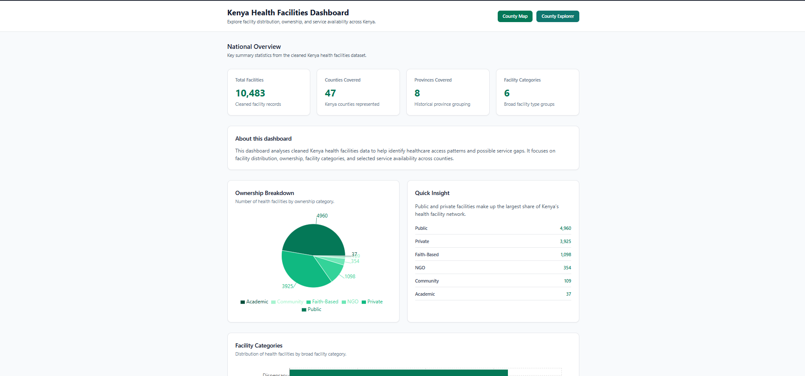
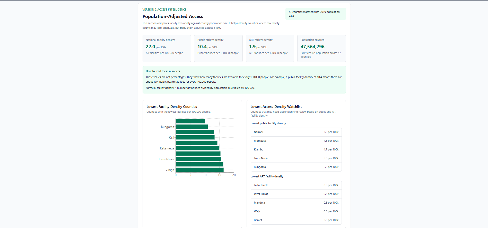
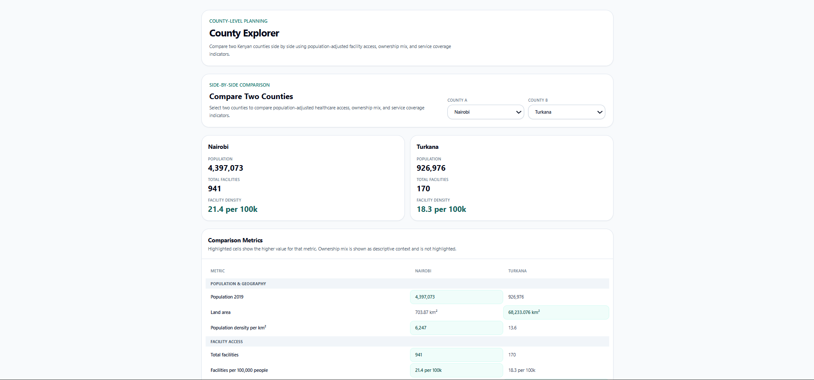
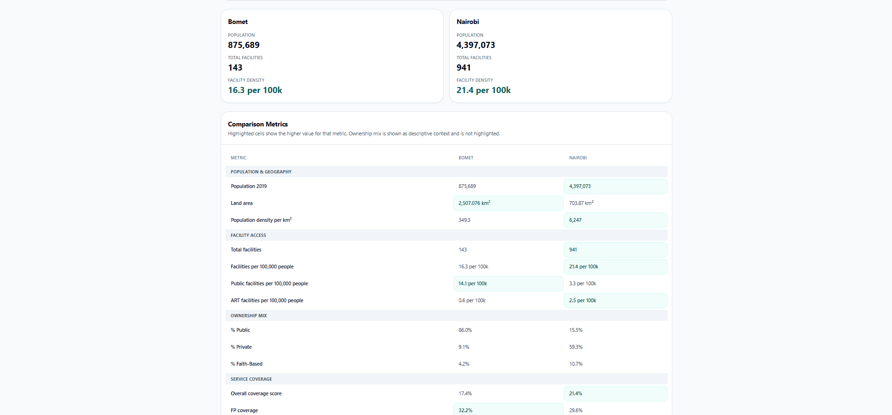

# Kenya Health Facilities Dashboard

A full-stack healthcare analytics dashboard that explores health facility distribution, ownership patterns, service availability, population-adjusted access, county comparison, planning priority, KDHS 2022 indicators, and health need-adjusted planning insights across Kenya.

The project helps users move from raw facility records into practical healthcare planning signals.

---

## Live Demo

### Frontend

https://kenya-health-dashboard.vercel.app/

### County Explorer

https://kenya-health-dashboard.vercel.app/county-explorer

### Backend API

https://kenya-health-dashboard-api.onrender.com/

### API Documentation

https://kenya-health-dashboard-api.onrender.com/docs

### GitHub Repository

https://github.com/arapkirui513-hub/kenya-health-dashboard

---

## Project Question

The dashboard is built around this core question:

```text
To what extent does the county-level distribution of healthcare facilities in Kenya reflect both public health need and healthcare market dynamics?
```

The dashboard helps answer questions such as:

* Which counties have the most health facilities?
* Which counties have fewer facilities relative to population size?
* What ownership categories dominate healthcare provision?
* Which counties rely more on public facilities?
* Which counties show stronger private healthcare market activity?
* Which counties show strong faith-based or NGO-supported delivery?
* Which counties appear underserved by selected services?
* Which counties should planners pay attention to first?
* Which counties show higher KDHS-based health need?
* How do two counties compare across access, ownership, service coverage, planning priority, and health need?

---

## Version 4 Update

Version 4 expands the dashboard from planning priority into health need-adjusted planning intelligence.

Version 4 helps answer:

```text
Which counties show higher health need when KDHS 2022 county-level indicators are added?
```

Core V4 feature:

```text
Health Need Index
```

The index ranks all 47 counties using selected KDHS 2022 indicators across reproductive health, maternal care, and child immunization.

Higher scores indicate stronger KDHS-based health need.

Health need levels:

```text
High Health Need: 60-100
Moderate Health Need: 35-59
Lower Health Need: 0-34
```

V4 scoring formula:

```text
Health Need Index =
Teenage Pregnancy Risk x 0.15
+ Family Planning Need Risk x 0.25
+ Maternal Care Gap Risk x 0.40
+ Child Immunization Gap Risk x 0.20
```

New V4 features:

* KDHS 2022 county indicator data layer
* New backend endpoint: `/kdhs-indicators`
* New backend endpoint: `/health-need-index`
* Health Need Index formula documentation
* Main dashboard Health Need Index section
* Top 10 health-need counties
* High / Moderate / Lower health-need summary cards
* Health-need reason flags
* County Explorer health-need comparison
* Side-by-side KDHS indicator comparison between two counties
* Nairobi and Nairobi City county matching support

Production validation:

```text
/kdhs-indicators returns 47 counties
/health-need-index returns 47 counties
Live dashboard shows Health Need Index
County Explorer shows health-need comparison metrics
```

V4 documentation:

```text
docs/V4_KDHS_INDICATOR_DICTIONARY.md
docs/V4_HEALTH_NEED_INDEX_FORMULA.md
docs/V4_COMPLETION_REPORT.md
```

---

## Version 3 Update

Version 3 turns the dashboard from analysis into prioritization.

Version 3 helps answer:

```text
Which counties should planners pay attention to first?
```

Core V3 feature:

```text
County Planning Priority Index
```

The index ranks all 47 counties using a score from 0 to 100.

Higher scores indicate higher planning priority.

Priority levels:

```text
High: 70-100
Medium: 40-69
Low: 0-39
```

V3 scoring formula:

```text
Priority Score =
Access Risk x 0.40
+ Service Risk x 0.30
+ Ownership Risk x 0.20
+ Population Pressure x 0.10
```

New V3 features:

* County Planning Priority Index
* New backend endpoint: `/planning-priority-index`
* Access risk scoring
* Service risk scoring
* Ownership risk scoring
* Population pressure scoring
* Reason flags explaining planning signals
* Main dashboard priority index section
* Top 10 planning priority counties
* High / Medium / Low priority summary cards
* County Explorer priority score integration
* Side-by-side priority comparison between two counties
* Python runtime pinned for stable Render deployment

Production validation:

```text
/planning-priority-index returns 47 counties
Live dashboard shows County Planning Priority Index
County Explorer shows planning priority cards and comparison metrics
```

V3 Completion Report:

```text
docs/V3_COMPLETION_REPORT.md
```

---

## Version 2 Update

Version 2 expands the dashboard from facility distribution analytics into population-adjusted healthcare access analysis, county comparison, planning interpretation, printable reporting, backend reliability, mobile polish, and ownership-based market dynamics analysis.

Version 1 helped answer:

```text
Where are health facilities located across Kenya?
What services are available?
What ownership categories dominate healthcare provision?
Which counties appear underserved by selected services?
```

Version 2 now helps answer:

```text
Are facilities distributed according to population size?
Which counties have lower population-adjusted facility access?
How do two counties compare across access, ownership, geography, and service coverage?
What does ownership mix suggest about healthcare market structure?
Which counties depend more on public, private, faith-based, or NGO-supported care?
```

New V2 features:

* Population-adjusted facility access analysis
* County population integration using 2019 population data
* Facility density per 100,000 people
* Public facility density per 100,000 people
* ART facility density per 100,000 people
* County Explorer comparison page
* Ownership mix comparison
* Geography and population comparison
* Service gap comparison
* County insight briefs
* Printable county comparison reports
* Ownership & Market Dynamics dashboard section
* Backend API hardening and validation
* Mobile and UI polish
* Production release tagging through v2.4.0

V2 Completion Report:

```text
docs/V2_COMPLETION_REPORT.md
```

---

## Screenshots

### Homepage



### Population-Adjusted Access



### County Explorer



### County Comparison Table



---

## Features

### 1. National Dashboard Overview

The homepage summarizes national facility distribution and service availability.

Key views include:

* Total facilities
* County distribution
* Ownership breakdown
* Facility type breakdown
* Service availability overview
* County-level analytics

---

### 2. Population-Adjusted Access

The dashboard includes a Version 2 access intelligence section using 2019 county population data.

It shows:

* Total population matched to facility data
* Total facilities
* Facilities per 100,000 people
* Public facilities per 100,000 people
* ART facilities per 100,000 people
* Lowest access-density county watchlists

This improves the dashboard by shifting analysis from raw facility counts to population-adjusted planning indicators.

---

### 3. County Planning Priority Index

The dashboard includes a Version 3 County Planning Priority Index.

It ranks all 47 counties using:

* Access risk
* Service risk
* Ownership risk
* Population pressure

The index helps identify counties that may require stronger planning attention.

The dashboard displays:

* Highest planning-priority counties
* Average priority score
* High / Medium / Low priority counts
* Top 10 planning priority counties
* Reason flags explaining the planning signal

Backend endpoint:

```text
GET /planning-priority-index
```

---

### 4. Health Need Index

The dashboard includes a Version 4 Health Need Index using KDHS 2022 county-level indicators.

It ranks all 47 counties using reproductive health, maternal care, and child immunization indicators.

The Health Need Index includes:

* Teenage pregnancy risk
* Family planning need risk
* Maternal care gap risk
* Child immunization gap risk

The dashboard displays:

* Highest health-need county
* Average health need score
* High / Moderate / Lower health need counts
* Top 10 health-need counties
* Score bars
* Level badges
* Reason flags

Backend endpoint:

```text
GET /health-need-index
```

---

### 5. County Explorer

The County Explorer page allows users to compare two counties side by side.

Comparison areas include:

* Population
* Land area
* Population density
* Facility counts
* Facility density per 100,000 people
* Public facility density
* ART facility density
* Ownership mix
* Service gap score
* County Planning Priority Index
* Health Need Index
* KDHS 2022 health indicators

The County Explorer supports direct comparison between counties such as:

```text
Nairobi vs Turkana
Mandera vs Nyeri
```

---

### 6. County Insight Briefs

The County Explorer includes short interpretation briefs that explain differences between selected counties.

Insight areas include:

* Access interpretation
* Ownership mix interpretation
* Service gap interpretation
* Planning priority interpretation
* Health need interpretation

These briefs help users understand what the numbers suggest in plain language.

---

### 7. Printable County Reports

The County Explorer supports printable county comparison reports.

Reports include:

* Selected counties
* Population and geography metrics
* Facility access metrics
* Ownership mix
* Service gap metrics
* Planning priority metrics
* Health need metrics
* Insight brief
* Report timestamp
* Dashboard links

This makes the dashboard useful beyond screen-based exploration.

---

### 8. Ownership & Market Dynamics

The dashboard includes ownership-based market dynamics analysis.

It helps users understand how healthcare delivery differs by ownership type.

Ownership groups include:

* Public
* Private
* Faith-based
* NGO-supported
* Other ownership categories

The section helps identify:

* Counties with stronger public-sector dependence
* Counties with stronger private-sector presence
* Counties with significant faith-based or NGO-supported delivery
* Counties with more balanced or imbalanced ownership structures

---

### 9. Facility Finder

The dashboard includes a searchable and filterable facility table.

Users can:

* Search facilities by name
* Filter by county
* Filter by owner
* Filter by facility type
* Filter by service availability
* Export facility records to CSV

---

### 10. County Map

The dashboard includes a county-level map for spatial exploration.

It supports:

* County-level geographic display
* Interactive county exploration
* Spatial context for facility distribution

---

### 11. Backend API

The FastAPI backend exposes structured healthcare analytics endpoints.

Main endpoint groups include:

* Facility records
* County summaries
* Service availability
* Service gap scoring
* Population-adjusted access
* Planning priority index
* KDHS 2022 indicators
* Health Need Index
* Health check

The backend powers both the dashboard and the public API documentation.

---

## API Endpoints

| Endpoint                   | Purpose                             |
| -------------------------- | ----------------------------------- |
| `/`                        | API root                            |
| `/health`                  | Backend health check                |
| `/facilities`              | Facility records                    |
| `/counties`                | County-level facility summaries     |
| `/owners`                  | Ownership categories                |
| `/types`                   | Facility type categories            |
| `/services`                | Service availability fields         |
| `/service-gap-score`       | County-level service gap scoring    |
| `/population`              | County-level 2019 population data   |
| `/access-density`          | Population-adjusted facility access |
| `/planning-priority-index` | County Planning Priority Index      |
| `/kdhs-indicators`         | KDHS 2022 county indicator data     |
| `/health-need-index`       | KDHS-based Health Need Index        |
| `/facilities/export`       | CSV facility export                 |

API documentation:

```text
https://kenya-health-dashboard-api.onrender.com/docs
```

---

## Key Metrics

The dashboard includes raw, adjusted, and composite metrics.

### Facility and ownership metrics

```text
Total facilities
Facilities by county
Facilities by ownership
Facilities by facility type
Public facility share
Private facility share
Faith-based / NGO-supported share
```

### Population-adjusted access metrics

```text
Population 2019
Land area
Population density
Facilities per 100,000 people
Public facilities per 100,000 people
ART facilities per 100,000 people
```

### Service availability metrics

```text
Family Planning availability
In-Patient Department availability
Home-Based Care availability
C-IMCI availability
ART availability
Service gap score
```

### Planning priority metrics

```text
Priority score
Priority level
Access risk
Service risk
Ownership risk
Population pressure
Planning reason flags
```

### Health need metrics

```text
Health need score
Health need level
Teenage pregnancy risk
Family planning need risk
Maternal care gap risk
Child immunization gap risk
Health-need reason flags
```

---

## Data Sources

The dashboard uses Kenya health facility data, county-level population data, and KDHS 2022 county-level health indicators.

Integrated data includes:

* County facility records
* Facility ownership categories
* Facility type categories
* Service availability fields
* 2019 county population data
* County land area
* KDHS 2022 county-level reproductive health indicators
* KDHS 2022 county-level maternal care indicators
* KDHS 2022 county-level child immunization indicators

V4 KDHS indicators include:

```text
teenage_pregnancy_pct
modern_contraceptive_use_pct
unmet_need_family_planning_pct
anc_4plus_visits_pct
skilled_delivery_pct
facility_delivery_pct
fully_vaccinated_basic_pct
```

Supporting documentation:

```text
docs/V4_KDHS_INDICATOR_DICTIONARY.md
docs/V4_HEALTH_NEED_INDEX_FORMULA.md
```

---

## Interpretation Framework

The dashboard does not claim causation.

It provides structured indicators that support planning discussion.

The results should be interpreted as planning signals rather than final policy decisions.

Examples:

```text
A county with fewer facilities per 100,000 people may need access review.
A county with a high planning priority score may need closer infrastructure and service assessment.
A county with high health need may need deeper review of reproductive, maternal, or child health indicators.
A county with strong private-sector presence may have different market dynamics from a public-sector-dependent county.
```

The dashboard is strongest when multiple indicators are interpreted together:

```text
Facility access
Population pressure
Service availability
Ownership mix
Planning priority
KDHS health need
```

---

## Tech Stack

### Frontend

* React
* Vite
* Tailwind CSS
* Recharts
* React Router
* React Leaflet
* Lucide React

### Backend

* FastAPI
* Python
* Pandas
* Uvicorn

### Deployment and DevOps

* Vercel for frontend
* Render for backend
* GitHub for version control and releases
* GitHub Actions for backend keep-awake workflow

---

## Project Structure

```text
kenya-health-dashboard/
│
├── backend/
│   ├── main.py
│   ├── data_loader.py
│   ├── utils.py
│   ├── requirements.txt
│   ├── runtime.txt
│   └── data/
│       ├── county_population.csv
│       └── kdhs_2022_county_indicators.csv
│
├── frontend/
│   ├── src/
│   │   ├── components/
│   │   │   ├── HealthNeedIndexSection.jsx
│   │   │   ├── CountyComparisonTool.jsx
│   │   │   └── MarketDynamicsSection.jsx
│   │   ├── pages/
│   │   │   ├── Dashboard.jsx
│   │   │   └── CountyExplorer.jsx
│   │   ├── config/
│   │   │   └── api.js
│   │   └── main.jsx
│   ├── package.json
│   └── vite.config.js
│
├── docs/
│   ├── screenshots/
│   ├── V1_COMPLETION_REPORT.md
│   ├── V2_COMPLETION_REPORT.md
│   ├── V3_COMPLETION_REPORT.md
│   ├── V4_KDHS_INDICATOR_DICTIONARY.md
│   ├── V4_HEALTH_NEED_INDEX_FORMULA.md
│   └── V4_COMPLETION_REPORT.md
│
├── .github/
│   └── workflows/
│       └── keep-backend-awake.yml
│
└── README.md
```

---

## Local Development

### 1. Clone the repository

```bash
git clone https://github.com/arapkirui513-hub/kenya-health-dashboard.git
cd kenya-health-dashboard
```

---

### 2. Backend setup

```bash
cd backend
python -m venv .venv312
.venv312\Scripts\activate
pip install -r requirements.txt
uvicorn main:app --reload
```

Backend local URL:

```text
http://127.0.0.1:8000
```

API docs:

```text
http://127.0.0.1:8000/docs
```

---

### 3. Frontend setup

```bash
cd frontend
npm install
npm run dev
```

Frontend local URL:

```text
http://localhost:5173/
```

County Explorer local URL:

```text
http://localhost:5173/county-explorer
```

---

## Environment Variables

Production frontend uses:

```text
VITE_API_BASE_URL=https://kenya-health-dashboard-api.onrender.com
```

Local development can use:

```text
VITE_API_BASE_URL=http://127.0.0.1:8000
```

---

## Validation Checklist

Before merging a feature branch, confirm:

* Backend starts without errors
* Frontend builds successfully
* `/health` returns backend status
* `/counties` returns county summaries
* `/access-density` returns 47 counties
* `/planning-priority-index` returns 47 counties
* `/kdhs-indicators` returns 47 counties
* `/health-need-index` returns 47 counties
* Dashboard homepage loads
* Population-Adjusted Access section renders
* Ownership & Market Dynamics section renders
* County Planning Priority Index section renders
* Health Need Index section renders
* County Explorer page loads
* County comparison works
* Planning priority comparison works
* Health need comparison works
* Printable report generates
* Production frontend redeploys successfully

---

## Version Control

The project uses feature branches and release tags.

Example branches used:

```text
feature/service-gap-insights
feature/backend-health-check
v2-access-density-ui
v3-planning-priority-index
v4-kdhs-indicator-data
v4-kdhs-indicators-api
v4-health-need-index-formula
v4-health-need-index-api
v4-health-need-index-ui
v4-health-need-county-explorer
v4-docs-completion-report
```

Release tags:

```text
v1.0.0
v2.0.0
v2.1.0
v2.2.0
v2.2.1
v2.3.0
v2.4.0
v2.4.1
v3.0.0
v4.0.0
```

---

## Release History

### v1.0.0

Initial full-stack dashboard release with facility distribution, ownership analysis, service availability, Facility Finder, CSV export, and county map.

Included:

* Facility distribution dashboard
* Ownership analysis
* Service availability summary
* Facility Finder
* CSV export
* County map
* FastAPI backend
* React frontend
* Vercel and Render deployment

---

### v2.0.0

Population-adjusted access and Version 2 dashboard expansion.

Added:

* County population data
* `/population` endpoint
* `/access-density` endpoint
* Facility density per 100,000 people
* Public facility density per 100,000 people
* ART facility density per 100,000 people

---

### v2.1.0

County Explorer comparison release.

Added:

* County Explorer page
* Two-county comparison interface
* Population comparison
* Access density comparison
* Ownership comparison
* Service gap comparison

---

### v2.2.0

Printable county comparison report release.

Added:

* Plain-language comparison summaries
* Printable county comparison report
* Report timestamp and dashboard links
* Portfolio-ready reporting flow

---

### v2.3.0

Backend hardening, mobile polish, and API standardization release.

Added:

* Backend API validation and security improvements
* Cleaner API version reporting
* Improved production readiness
* Mobile UI polish
* Stable release checkpoint before ownership analysis

---

### v2.4.0

Ownership and market dynamics release.

Added:

* Ownership & Market Dynamics dashboard section
* Private facility share analysis by county
* Public facility share analysis by county
* Faith-based / NGO presence analysis
* Ownership interpretation labels
* Market dynamics planning signals

---

### v2.4.1

Version 2 documentation and cleanup release.

Added:

* Updated README documentation
* Version 2 completion report
* Production validation summary
* Release-ready project documentation

Status:

```text
Version 2 complete
```

---

### v3.0.0

County Planning Priority Index release.

Added:

* County Planning Priority Index
* `/planning-priority-index` API endpoint
* Access risk scoring
* Service risk scoring
* Ownership risk scoring
* Population pressure scoring
* Planning reason flags
* Dashboard priority section
* County Explorer planning priority comparison
* Version 3 completion report

Status:

```text
Version 3 complete
```

---

### v4.0.0

Health need-adjusted planning intelligence release.

Added:

* KDHS 2022 county indicator data layer
* Health Need Index
* `/kdhs-indicators` API endpoint
* `/health-need-index` API endpoint
* Health Need Index dashboard section
* County Explorer health-need comparison
* KDHS indicator comparison metrics
* V4 formula documentation
* V4 completion report

Status:

```text
Version 4 feature implementation complete
```

---

## Portfolio Value

This project demonstrates:

* Healthcare data cleaning
* Backend API design
* Frontend dashboard development
* Population-adjusted analytics
* Composite index design
* Health need indicator modeling
* County comparison logic
* Data storytelling
* Public health planning interpretation
* Full-stack deployment
* GitHub version control and release management

---

## Limitations

The dashboard is a planning intelligence tool, not a final policy model.

Limitations include:

* Facility records may not represent real-time facility status.
* Population data is based on 2019 county population figures.
* KDHS indicators are survey-based and should be interpreted with context.
* Service availability does not measure quality, staffing, equipment readiness, or utilization.
* Composite scores depend on selected weights and should be reviewed before operational use.

---

## Future Work

Potential future improvements include:

* Add disease burden indicators where reliable county-level data is available
* Add more years of population data for trend analysis
* Add downloadable county comparison reports as PDF
* Add more service-specific dashboards
* Add chart export support
* Add automated backend data refresh workflow
* Add more advanced geospatial analysis
* Add sub-county analysis if reliable data becomes available

---

## Author

Built by Kevin Kirui as part of the Data by Design healthcare analytics portfolio.

GitHub:

```text
https://github.com/arapkirui513-hub
```

Live dashboard:

```text
https://kenya-health-dashboard.vercel.app/
```
